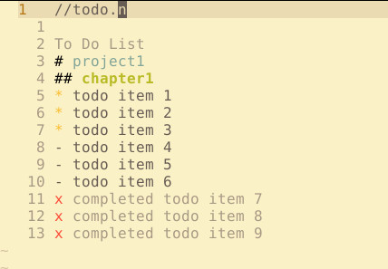

# vim-todolist-colorscheme
Simple syntax highlighting for vim todo notes.

## Usage:

download:
`Plug 'weiguoquan422/vim-todolist-colorscheme'`

and add this in your .vimrc:

```
autocmd BufWinEnter *.n colorscheme notes
autocmd BufWinEnter *.n set foldcolumn=2
```

recommended colorscheme:
```
"color scheme
colorscheme gruvbox
set background=light
```

## Example


## Thanks
<https://github.com/mathewkramsch/vim_todo>
